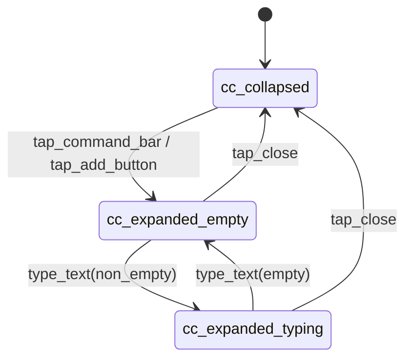
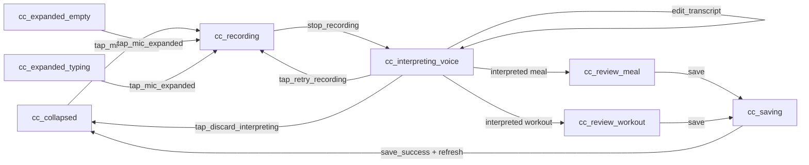
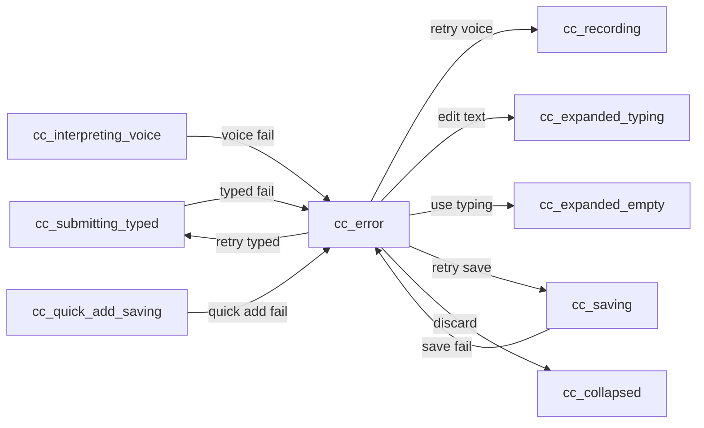

# Command Center Interaction + State Spec (v3)

- Last updated: 2026-02-10
- Screen: Command Center (cross-screen persistent control)
- Status: Draft v3.0 (review-state parity with meal/workout prototypes)
- Owner: Product + Design + Eng

## Source links
- UI source-of-truth index: `/Users/samarth/Desktop/Work/voicefit-all/voicefit-mobile/prototypes/spec-ui-source-of-truth.md`
- Design decisions: `/Users/samarth/Desktop/Work/voicefit-all/voicefit-mobile/prototypes/design-decisions.md`
- Home implementation checklist: `/Users/samarth/Desktop/Work/voicefit-all/voicefit-mobile/prototypes/implementation-checklists/home-screen-implementation-checklist.md`
- Expanded command center prototype: `/Users/samarth/Desktop/Work/voicefit-all/voicefit-mobile/prototypes/log.html`
- Voice recording prototype: `/Users/samarth/Desktop/Work/voicefit-all/voicefit-mobile/prototypes/voice-recording.html`
- Review meal prototype: `/Users/samarth/Desktop/Work/voicefit-all/voicefit-mobile/prototypes/voice-review-meal.html`
- Review workout prototype: `/Users/samarth/Desktop/Work/voicefit-all/voicefit-mobile/prototypes/voice-review-workout.html`

## Rendered diagram artifacts
- Panel/open-close states (PNG): `/Users/samarth/Desktop/Work/voicefit-all/voicefit-mobile/prototypes/interaction-specs/diagrams/command-center-panel-states.png`
- Primary typed + quick-add flow (PNG): `/Users/samarth/Desktop/Work/voicefit-all/voicefit-mobile/prototypes/interaction-specs/diagrams/command-center-typed-quickadd-flow.png`
- Primary voice + interpret flow (PNG): `/Users/samarth/Desktop/Work/voicefit-all/voicefit-mobile/prototypes/interaction-specs/diagrams/command-center-voice-interpret-flow.png`
- Error and recovery flow (PNG): `/Users/samarth/Desktop/Work/voicefit-all/voicefit-mobile/prototypes/interaction-specs/diagrams/command-center-error-flow.png`
- Diagram path index: `/Users/samarth/Desktop/Work/voicefit-all/voicefit-mobile/prototypes/interaction-specs/diagrams/README.md`
- Implementation screenshots (web): `/Users/samarth/Desktop/Work/voicefit-all/voicefit-mobile/output/playwright/home-states/`

## Rendered command-center implementation screenshots (web)
- Expanded empty: `/Users/samarth/Desktop/Work/voicefit-all/voicefit-mobile/output/playwright/home-states/02-cc-expanded-empty.png`
- Expanded typing: `/Users/samarth/Desktop/Work/voicefit-all/voicefit-mobile/output/playwright/home-states/03-cc-expanded-typing.png`
- Submitting typed: `/Users/samarth/Desktop/Work/voicefit-all/voicefit-mobile/output/playwright/home-states/04-cc-submitting-typed.png`
- Review state: `/Users/samarth/Desktop/Work/voicefit-all/voicefit-mobile/output/playwright/home-states/05-cc-review-state.png`
- Review workout state: `/Users/samarth/Desktop/Work/voicefit-all/voicefit-mobile/output/playwright/home-states/06b-cc-review-workout.png`
- Auto-saving: `/Users/samarth/Desktop/Work/voicefit-all/voicefit-mobile/output/playwright/home-states/05-cc-auto-saving.png`
- Quick-add saving: `/Users/samarth/Desktop/Work/voicefit-all/voicefit-mobile/output/playwright/home-states/07-cc-quick-add-saving.png`
- Recording: `/Users/samarth/Desktop/Work/voicefit-all/voicefit-mobile/output/playwright/home-states/09-cc-recording.png`
- Interpreting voice: `/Users/samarth/Desktop/Work/voicefit-all/voicefit-mobile/output/playwright/home-states/10-cc-interpreting-voice.png`
- Error voice interpret: `/Users/samarth/Desktop/Work/voicefit-all/voicefit-mobile/output/playwright/home-states/11-cc-error-voice.png`
- Error typed interpret: `/Users/samarth/Desktop/Work/voicefit-all/voicefit-mobile/output/playwright/home-states/13-cc-error-typed.png`
- Error auto-save: `/Users/samarth/Desktop/Work/voicefit-all/voicefit-mobile/output/playwright/home-states/14-cc-error-save.png`
- Error mic permission: `/Users/samarth/Desktop/Work/voicefit-all/voicefit-mobile/output/playwright/home-states/15-cc-error-mic-permission.png`
- Error quick add: `/Users/samarth/Desktop/Work/voicefit-all/voicefit-mobile/output/playwright/home-states/16-cc-error-quick-add.png`

## 0) Terminology (clarification)
- `cc_review_meal`: review and edit parsed meal details before save.
- `cc_review_workout`: review and edit parsed workout details before save.
- `cc_saving`: save-in-progress after review confirmation.

## 1) Purpose and scope
Define exact behavior of the persistent Command Center so typed, voice, and quick-add actions are deterministic across Home, Workouts, Settings, and future screens.

Included in scope:
- Collapsed and expanded command center behaviors.
- Typed command flow (interpret -> review -> save for meal/workout intents).
- Voice command flow (record -> interpret -> review -> save).
- Quick add from recent items.
- Error handling and retry behavior.

Out of scope:
- Detailed schema of meal/workout entities after save.
- Detailed behavior of destination screens after navigation.

## 2) State model

### 2.1 Panel and input states
- `cc_collapsed`: persistent bar above tab bar.
- `cc_expanded_empty`: sheet open, textarea empty.
- `cc_expanded_typing`: sheet open, textarea has non-empty text.
- `cc_submitting_typed`: typed text being interpreted.

### 2.2 Voice/save states
- `cc_recording`: listening, timer + waveform active.
- `cc_interpreting_voice`: recording stopped; transcript shown while interpretation runs; user can edit/interrupt.
- `cc_review_meal`: parsed meal review card with save/discard.
- `cc_review_workout`: parsed workout review card with save/discard.
- `cc_saving`: save in progress after review confirmation.
- `cc_quick_add_saving`: quick-add row save in progress.
- `cc_error`: recoverable error state.

## 3) Event-to-transition table

### 3.1 Panel and typed transitions

| Event | From | To | Guard/Condition | Side effects |
|---|---|---|---|---|
| `tap_command_bar` | `cc_collapsed` | `cc_expanded_empty` | Always | Open sheet + dim backdrop. |
| `tap_add_button` | `cc_collapsed` | `cc_expanded_empty` | Always | Open sheet + focus textarea optional. |
| `tap_close` | `cc_expanded_empty` or `cc_expanded_typing` | `cc_collapsed` | Always | Dismiss sheet. |
| `type_text(non_empty)` | `cc_expanded_empty` | `cc_expanded_typing` | Trimmed text length > 0 | Enable send button. |
| `type_text(empty)` | `cc_expanded_typing` | `cc_expanded_empty` | Trimmed text length == 0 | Disable send button. |
| `tap_send_typed` | `cc_expanded_typing` | `cc_submitting_typed` | Non-empty text | Interpret typed input. |
| `typed_interpret_success` | `cc_submitting_typed` | `cc_review_meal` or `cc_review_workout` | Parse class = meal/workout | Populate review card and wait for explicit save. |
| `typed_interpret_failure` | `cc_submitting_typed` | `cc_error` | Parse failed | Preserve typed draft for retry/edit. |

### 3.2 Voice transitions

| Event | From | To | Guard/Condition | Side effects |
|---|---|---|---|---|
| `tap_mic_collapsed` | `cc_collapsed` | `cc_recording` | Mic permission granted | Open recording sheet. |
| `tap_mic_expanded` | `cc_expanded_empty` or `cc_expanded_typing` | `cc_recording` | Mic permission granted | Open recording sheet. |
| `mic_permission_denied` | `cc_collapsed` or `cc_expanded_empty` or `cc_expanded_typing` | `cc_error` | OS denied | Show permission recovery action. |
| `stop_recording` | `cc_recording` | `cc_interpreting_voice` | Transcript available | Start interpretation and show transcript text. |
| `edit_transcript` | `cc_interpreting_voice` | `cc_interpreting_voice` | User edits transcript text | Cancel/restart interpretation with edited transcript. |
| `voice_interpret_success` | `cc_interpreting_voice` | `cc_review_meal` or `cc_review_workout` | Parse class = meal/workout | Populate review card and wait for explicit save. |
| `voice_interpret_failure` | `cc_interpreting_voice` | `cc_error` | Interpret failed | Keep last transcript for retry/edit. |
| `tap_retry_recording` | `cc_interpreting_voice` | `cc_recording` | User chooses to re-record | Discard current transcript and restart capture. |
| `tap_discard_interpreting` | `cc_interpreting_voice` | `cc_collapsed` | User exits flow | Dismiss sheet without saving. |

### 3.3 Save and quick-add transitions

| Event | From | To | Guard/Condition | Side effects |
|---|---|---|---|---|
| `tap_save_review` | `cc_review_meal` or `cc_review_workout` | `cc_saving` | Always | Create final payload and save. |
| `save_success` | `cc_saving` | `cc_collapsed` | Always | Dismiss overlays + trigger host refresh + success toast. |
| `save_failure` | `cc_saving` | `cc_error` | API failure | Keep interpreted payload for retry. |
| `tap_quick_add_item` | `cc_expanded_empty` or `cc_expanded_typing` | `cc_quick_add_saving` | Item has valid template data | Save selected quick-add item directly. |
| `quick_add_success` | `cc_quick_add_saving` | `cc_collapsed` | Always | Dismiss + refresh + success toast with undo window. |
| `quick_add_failure` | `cc_quick_add_saving` | `cc_error` | API failure | Return actionable retry path. |
| `tap_retry_typed` | `cc_error` | `cc_submitting_typed` | Error category = typed interpret | Retry typed interpretation with preserved draft. |
| `tap_retry_recording_from_error` | `cc_error` | `cc_recording` | Error category = voice interpret | Start a fresh recording attempt. |
| `tap_retry_save` | `cc_error` | `cc_saving` or `cc_quick_add_saving` | Error category = save | Re-run prior save request. |
| `tap_edit_text_from_error` | `cc_error` | `cc_expanded_typing` | Error category in {typed interpret, voice interpret} | Open expanded sheet with draft/transcript prefilled for editing. |
| `tap_use_typed_instead` | `cc_error` | `cc_expanded_empty` | Error category = mic permission | Open expanded sheet to continue with typing. |
| `tap_open_settings` | `cc_error` | `cc_error` | Error category = mic permission | Open OS Settings app; keep error state when user returns. |
| `tap_discard_error` | `cc_error` | `cc_collapsed` | Always | Exit flow cleanly. |

## 4) UI contract by state

| State | Required visible UI | Disabled/hidden UI | Notes |
|---|---|---|---|
| `cc_collapsed` | Sparkle icon, placeholder text, mic button | Expanded sheet hidden | Persistent on all main screens. |
| `cc_expanded_empty` | Sheet handle, title, close, textarea placeholder, quick-add list, mic button, disabled send | Underlying host screen interaction blocked | Textarea empty state. |
| `cc_expanded_typing` | Same as expanded-empty + active send button | None | Typing allowed; keyboard state preserved. |
| `cc_submitting_typed` | Expanded sheet with interpreting indicator + typed text | Inputs temporarily disabled | Pending typed interpretation. |
| `cc_recording` | Timer, recording indicator, waveform, stop button | Host interaction blocked | Matches voice-recording prototype. |
| `cc_interpreting_voice` | Transcript text block + interpreting indicator + `Edit text` + `Retry voice` + `Discard` actions | Background blocked | User can interrupt/edit while interpretation runs. |
| `cc_review_meal` | Review Meal sheet with transcript, confidence chip, parsed meal card, ingredient list, discard/save actions | Background blocked | Matches `voice-review-meal.html`. |
| `cc_review_workout` | Review Workout sheet with transcript, confidence chip, parsed workout card, discard/save actions | Background blocked | Matches `voice-review-workout.html`. |
| `cc_saving` | Compact saving state (spinner + summary) | Additional input disabled | Shared save state for typed/voice review paths. |
| `cc_quick_add_saving` | Quick-add row busy state (or global busy) | Additional taps blocked | Fast-path save state. |
| `cc_error` | Error title/body + contextual retry + secondary action + discard | Non-applicable actions hidden | Copy and CTA labels are fixed by error subtype table below. |

## 4.1 Locked controls contract

### 4.1.1 `cc_interpreting_voice` controls

| Control | Label | Availability | Behavior |
|---|---|---|---|
| Primary status indicator | `Interpreting...` | Always in `cc_interpreting_voice` | Shows spinner and in-progress status. |
| Secondary action | `Edit text` | Always | Focus transcript editor; any edit triggers `edit_transcript` and restarts interpretation. |
| Secondary action | `Retry voice` | Always | Triggers `tap_retry_recording`; starts fresh recording. |
| Tertiary action | `Discard` | Always | Triggers `tap_discard_interpreting`; returns to `cc_collapsed`. |

### 4.1.2 `cc_error` copy and CTA mapping (locked)

| Error subtype | Title | Body | Primary CTA | Secondary CTA | Tertiary CTA |
|---|---|---|---|---|---|
| `typed_interpret_failure` | `Couldn't understand that entry` | `Edit your text and try again.` | `Retry typed` | `Edit text` | `Discard` |
| `voice_interpret_failure` | `Couldn't understand your recording` | `Retry voice or edit the transcript.` | `Retry voice` | `Edit text` | `Discard` |
| `mic_permission_denied` | `Microphone access is off` | `Enable microphone in Settings to log by voice.` | `Open Settings` | `Use typing instead` | `Discard` |
| `auto_save_failure` | `Couldn't save right now` | `We kept your entry. Try saving again.` | `Retry save` | `Discard` | Hidden |
| `quick_add_failure` | `Couldn't add that item` | `Please try again.` | `Retry save` | `Discard` | Hidden |

### 4.1.3 `cc_error` CTA-to-transition mapping (locked)

| Error subtype | CTA label | Event | Target state |
|---|---|---|---|
| `typed_interpret_failure` | `Retry typed` | `tap_retry_typed` | `cc_submitting_typed` |
| `typed_interpret_failure` | `Edit text` | `tap_edit_text_from_error` | `cc_expanded_typing` |
| `typed_interpret_failure` | `Discard` | `tap_discard_error` | `cc_collapsed` |
| `voice_interpret_failure` | `Retry voice` | `tap_retry_recording_from_error` | `cc_recording` |
| `voice_interpret_failure` | `Edit text` | `tap_edit_text_from_error` | `cc_expanded_typing` |
| `voice_interpret_failure` | `Discard` | `tap_discard_error` | `cc_collapsed` |
| `mic_permission_denied` | `Open Settings` | `tap_open_settings` | `cc_error` |
| `mic_permission_denied` | `Use typing instead` | `tap_use_typed_instead` | `cc_expanded_empty` |
| `mic_permission_denied` | `Discard` | `tap_discard_error` | `cc_collapsed` |
| `auto_save_failure` | `Retry save` | `tap_retry_save` | `cc_saving` |
| `auto_save_failure` | `Discard` | `tap_discard_error` | `cc_collapsed` |
| `quick_add_failure` | `Retry save` | `tap_retry_save` | `cc_quick_add_saving` |
| `quick_add_failure` | `Discard` | `tap_discard_error` | `cc_collapsed` |

## 5) Side effects and data contracts

### 5.1 Interpretation contracts
- Typed and voice interpretation both produce one of:
  - valid meal/workout save payload
  - recoverable interpret error
- Voice interpretation uses transcript currently shown in `cc_interpreting_voice`.
- Any transcript edit invalidates current interpretation and restarts interpretation run.
- Meal/workout interpretation success routes into explicit review states before save.

### 5.2 Save contracts
- Save response must include enough metadata to trigger host query refresh.
- Successful saves trigger host screen refresh and close command center overlays.
- Quick-add saves should support an undo toast interval (recommended: 5 seconds).

### 5.3 Permission and platform side effects
- First mic attempt requests OS permission.
- Denied permission routes to error with `Open Settings` action.

## 6) Error and recovery rules
- Keep user-entered typed text on typed-interpret failure.
- Keep transcript text on voice interpret failure.
- Keep interpreted payload on auto-save failure.
- In `cc_error`, use the exact subtype copy and CTA labels from Section 4.1.2.
- In `cc_error`, show only the CTA set for the active error subtype.
- Discard always returns to `cc_collapsed` without residual overlays.

## 7) Mermaid diagrams

### 7.1 Command center panel/open-close states


### 7.2 Primary typed + quick-add flow
```mermaid
flowchart LR
  A[cc_collapsed] -->|open| B[cc_expanded_empty]
  B -->|type| C[cc_expanded_typing]
  C -->|send typed| D[cc_submitting_typed]
  D -->|interpreted meal| R1[cc_review_meal]
  D -->|interpreted workout| R2[cc_review_workout]
  R1 -->|save| E[cc_saving]
  R2 -->|save| E
  B -->|quick add| H[cc_quick_add_saving]
  C -->|quick add| H
  E -->|save ok| A
  H -->|save ok| A
  C -->|type_text(empty)| B
  B -->|tap_close| A
  C -->|tap_close| A
```

### 7.3 Primary voice + interpret flow


### 7.4 Error and recovery flow


## 8) QA acceptance checklist
- Collapsed bar appears on all tab root screens.
- Expanded sheet opens from both collapsed bar and add button.
- Send remains disabled when textarea is empty/whitespace.
- Typed send goes through interpret then review state for meal/workout before save.
- Voice stop transitions to interpreting state and then review state for meal/workout.
- Editing transcript during interpreting restarts interpretation.
- `cc_review_meal` and `cc_review_workout` match their respective prototype layouts and CTA behavior.
- Voice and typed successful paths both collapse only after explicit save from review.
- Quick-add success closes overlays and refreshes host screen data.
- Save/interpret failures enter recoverable error state with correct retry options.
- Each error subtype uses the locked title/body/CTA set from Section 4.1.2.
- Permission denial shows actionable recovery path.

## 9) Open decisions to resolve in v3
- Confirm if low-confidence interpretation should optionally re-enable legacy review screens.
- Confirm undo behavior and timeout for quick-add and auto-save toasts.
