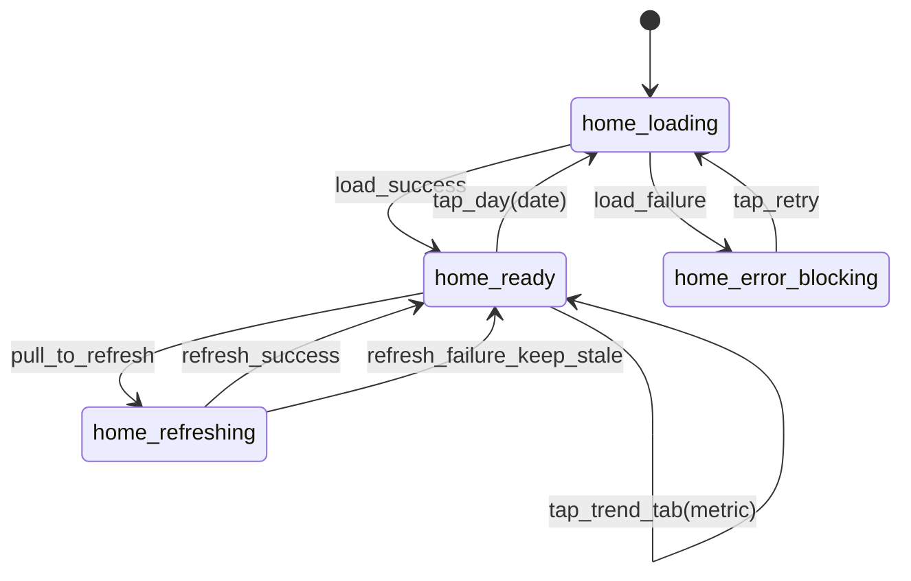
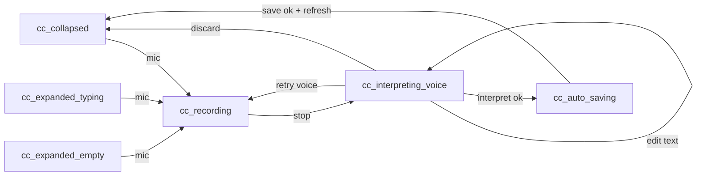
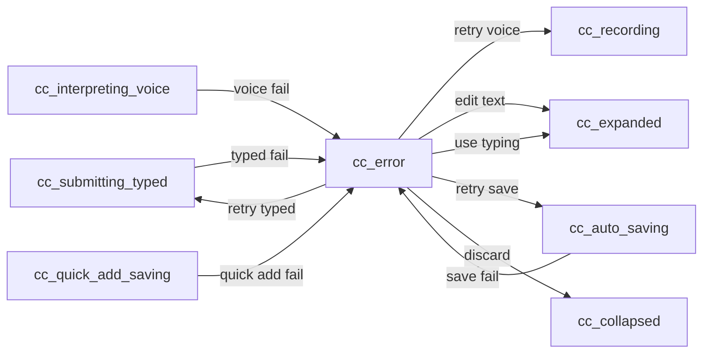
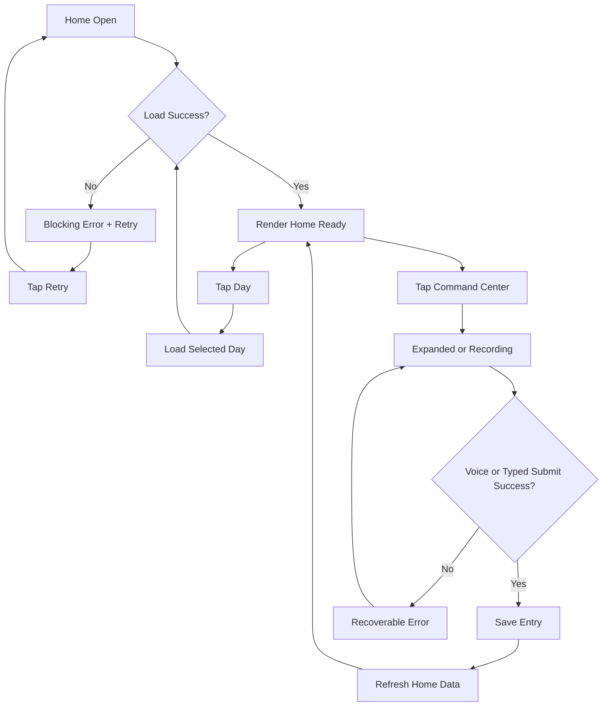

# Home Screen Interaction + State Spec (v1)

- Last updated: 2026-02-10
- Screen: Home
- Status: Draft v1.1 (aligned with locked command-center controls/copy)
- Owner: Product + Design + Eng

## Source links
- UI source-of-truth index: `/Users/samarth/Desktop/Work/voicefit-all/voicefit-mobile/prototypes/spec-ui-source-of-truth.md`
- Design decisions: `/Users/samarth/Desktop/Work/voicefit-all/voicefit-mobile/prototypes/design-decisions.md`
- Home implementation checklist: `/Users/samarth/Desktop/Work/voicefit-all/voicefit-mobile/prototypes/implementation-checklists/home-screen-implementation-checklist.md`
- Home prototype: `/Users/samarth/Desktop/Work/voicefit-all/voicefit-mobile/prototypes/home.html`
- Command center expanded prototype: `/Users/samarth/Desktop/Work/voicefit-all/voicefit-mobile/prototypes/log.html`
- Voice recording prototype: `/Users/samarth/Desktop/Work/voicefit-all/voicefit-mobile/prototypes/voice-recording.html`
- Home assets: `/Users/samarth/Desktop/Work/voicefit-all/voicefit-mobile/prototypes/assets/home/asset-inventory.md`
- Home implementation screenshots (web run): `/Users/samarth/Desktop/Work/voicefit-all/voicefit-mobile/output/playwright/home-states/`

## Rendered diagram artifacts
- Home data state diagram (PNG): `/Users/samarth/Desktop/Work/voicefit-all/voicefit-mobile/prototypes/interaction-specs/diagrams/home-data-state.png`
- Command center typed + quick-add flow (PNG): `/Users/samarth/Desktop/Work/voicefit-all/voicefit-mobile/prototypes/interaction-specs/diagrams/command-center-typed-quickadd-flow.png`
- Command center voice + interpret flow (PNG): `/Users/samarth/Desktop/Work/voicefit-all/voicefit-mobile/prototypes/interaction-specs/diagrams/command-center-voice-interpret-flow.png`
- Command center error/recovery flow (PNG): `/Users/samarth/Desktop/Work/voicefit-all/voicefit-mobile/prototypes/interaction-specs/diagrams/command-center-error-flow.png`
- Home interaction flowchart (PNG): `/Users/samarth/Desktop/Work/voicefit-all/voicefit-mobile/prototypes/interaction-specs/diagrams/home-interaction-flow.png`
- Diagram path index: `/Users/samarth/Desktop/Work/voicefit-all/voicefit-mobile/prototypes/interaction-specs/diagrams/README.md`

## Rendered Home implementation screenshots (web)
- Home collapsed ready: `/Users/samarth/Desktop/Work/voicefit-all/voicefit-mobile/output/playwright/home-states/01-home-collapsed.png`
- Command center expanded empty: `/Users/samarth/Desktop/Work/voicefit-all/voicefit-mobile/output/playwright/home-states/02-cc-expanded-empty.png`
- Command center expanded typing: `/Users/samarth/Desktop/Work/voicefit-all/voicefit-mobile/output/playwright/home-states/03-cc-expanded-typing.png`
- Typed interpreting: `/Users/samarth/Desktop/Work/voicefit-all/voicefit-mobile/output/playwright/home-states/04-cc-submitting-typed.png`
- Auto-saving: `/Users/samarth/Desktop/Work/voicefit-all/voicefit-mobile/output/playwright/home-states/05-cc-auto-saving.png`
- Post typed save collapse: `/Users/samarth/Desktop/Work/voicefit-all/voicefit-mobile/output/playwright/home-states/06-home-after-typed-save.png`
- Quick-add saving: `/Users/samarth/Desktop/Work/voicefit-all/voicefit-mobile/output/playwright/home-states/07-cc-quick-add-saving.png`
- Post quick-add save collapse: `/Users/samarth/Desktop/Work/voicefit-all/voicefit-mobile/output/playwright/home-states/08-home-after-quick-add.png`
- Recording: `/Users/samarth/Desktop/Work/voicefit-all/voicefit-mobile/output/playwright/home-states/09-cc-recording.png`
- Interpreting voice (editable transcript): `/Users/samarth/Desktop/Work/voicefit-all/voicefit-mobile/output/playwright/home-states/10-cc-interpreting-voice.png`
- Error voice interpret failure: `/Users/samarth/Desktop/Work/voicefit-all/voicefit-mobile/output/playwright/home-states/11-cc-error-voice.png`
- Error fallback to edit text: `/Users/samarth/Desktop/Work/voicefit-all/voicefit-mobile/output/playwright/home-states/12-cc-error-edit-text-fallback.png`
- Error typed interpret failure: `/Users/samarth/Desktop/Work/voicefit-all/voicefit-mobile/output/playwright/home-states/13-cc-error-typed.png`
- Error auto-save failure: `/Users/samarth/Desktop/Work/voicefit-all/voicefit-mobile/output/playwright/home-states/14-cc-error-save.png`
- Error mic permission denied: `/Users/samarth/Desktop/Work/voicefit-all/voicefit-mobile/output/playwright/home-states/15-cc-error-mic-permission.png`
- Error quick-add failure: `/Users/samarth/Desktop/Work/voicefit-all/voicefit-mobile/output/playwright/home-states/16-cc-error-quick-add.png`

## 1) Purpose and scope
Define exact behavior for Home screen UI and transitions so implementation, QA, and future agent handoffs use one canonical behavior contract.

Included in scope:
- Home content load/refresh/error behavior.
- Day picker and trends tab interactions.
- Home navigation actions (Coach, Meals, Workouts, Settings, Add).
- Command center collapsed-to-expanded behavior from Home.
- Voice flow entry points from Home through review/save outcomes.

Out of scope:
- Detailed Coach chat behavior (covered by Coach screen spec).
- Detailed Meals list/detail behavior (covered by Meals screen spec).
- Detailed workout/session behavior (covered by workout specs).

## 2) State model

### 2.1 Home data state machine
- `home_loading`: initial blocking fetch for selected day.
- `home_ready`: full Home content rendered for selected day.
- `home_refreshing`: non-blocking refresh after pull-to-refresh or retry from inline error.
- `home_error_blocking`: initial load failed and no renderable data exists.

### 2.2 Command center state machine (from Home)
- `cc_collapsed`: floating bar visible above tab bar.
- `cc_expanded`: expanded command center sheet shown.
- `cc_recording`: voice recording bottom sheet active.
- `cc_interpreting_voice`: transcript shown while interpretation runs; user can edit/interrupt.
- `cc_submitting_typed`: typed input is being interpreted.
- `cc_auto_saving`: direct save in progress after interpretation success.
- `cc_error`: non-blocking voice/interpret/save error sheet or inline error.

## 3) Event-to-transition table

### 3.1 Home data transitions

| Event | From | To | Guard/Condition | Side effects |
|---|---|---|---|---|
| `screen_opened` | `home_loading` | `home_ready` | API success | Render selected day data (default = today). |
| `screen_opened` | `home_loading` | `home_error_blocking` | API failure | Show blocking error state with Retry CTA. |
| `tap_retry_blocking` | `home_error_blocking` | `home_loading` | Always | Re-run Home load query. |
| `pull_to_refresh` | `home_ready` | `home_refreshing` | Always | Re-fetch selected day payload. |
| `refresh_success` | `home_refreshing` | `home_ready` | Always | Patch data in place, preserve scroll position. |
| `refresh_failure` | `home_refreshing` | `home_ready` | Keep stale data | Show toast/banner error, keep existing content. |
| `tap_day(date)` | `home_ready` | `home_loading` | Date is in visible 7-day strip | Set selected date, fetch day-specific payload. |
| `day_load_success` | `home_loading` | `home_ready` | Always | Render that day data; update day highlight. |
| `day_load_failure` | `home_loading` | `home_error_blocking` | No cached day data | Show blocking error for selected day. |
| `tap_trend_tab(metric)` | `home_ready` | `home_ready` | Metric in {calories, steps, weight} | Switch chart metric and summary text. |

### 3.2 Home navigation transitions

| Event | From | To | Guard/Condition | Side effects |
|---|---|---|---|---|
| `tap_ask_coach` | `home_ready` | `home_ready` | Always | Navigate to Coach screen. |
| `tap_recent_meals_see_all` | `home_ready` | `home_ready` | Always | Navigate to Meals screen. |
| `tap_add_button` | `home_ready` | `cc_expanded` | Always | Open command center expanded sheet. |
| `tap_tab_home` | `home_ready` | `home_ready` | Already on Home | No-op. |
| `tap_tab_workouts` | `home_ready` | `home_ready` | Always | Navigate to Workouts tab. |
| `tap_tab_settings` | `home_ready` | `home_ready` | Always | Navigate to Settings tab. |

### 3.3 Command center + voice transitions (from Home)

| Event | From | To | Guard/Condition | Side effects |
|---|---|---|---|---|
| `tap_command_bar` | `cc_collapsed` | `cc_expanded` | Always | Present expanded sheet over dimmed Home. |
| `tap_cc_close` | `cc_expanded` | `cc_collapsed` | Always | Dismiss expanded sheet. |
| `type_cc_text` | `cc_expanded` | `cc_expanded` | Text length >= 1 | Enable send affordance. |
| `tap_cc_send_empty` | `cc_expanded` | `cc_expanded` | Text length == 0 | No-op; keep send disabled. |
| `tap_cc_send_typed` | `cc_expanded` | `cc_submitting_typed` | Text length >= 1 | Start typed interpretation. |
| `typed_interpret_success` | `cc_submitting_typed` | `cc_auto_saving` | Interpretation success | Build payload and save directly (no review). |
| `typed_submit_failure` | `cc_submitting_typed` | `cc_error` | Interpret failure | Show retry/edit actions with typed text preserved. |
| `tap_cc_mic` | `cc_collapsed` | `cc_recording` | Mic permission granted | Open recording sheet. |
| `tap_cc_mic_big` | `cc_expanded` | `cc_recording` | Mic permission granted | Open recording sheet. |
| `permission_denied` | `cc_collapsed` or `cc_expanded` | `cc_error` | OS mic denied | Show permission error with “Open Settings”. |
| `stop_recording` | `cc_recording` | `cc_interpreting_voice` | Transcript available | Show transcript while interpreting. |
| `edit_transcript` | `cc_interpreting_voice` | `cc_interpreting_voice` | User updates text | Restart interpretation with edited text. |
| `tap_discard_interpreting` | `cc_interpreting_voice` | `cc_collapsed` | Always | Exit without saving. |
| `voice_interpret_success` | `cc_interpreting_voice` | `cc_auto_saving` | Interpretation success | Build payload and save directly. |
| `voice_interpret_failure` | `cc_interpreting_voice` | `cc_error` | Transcribe/interpret failure | Show retry and discard actions. |
| `save_success` | `cc_auto_saving` | `cc_collapsed` | Always | Dismiss sheet, refresh Home data, show success toast. |
| `save_failure` | `cc_auto_saving` | `cc_error` | API failure | Show save error with Retry. |
| `tap_discard` | `cc_error` | `cc_collapsed` | Always | Dismiss all command-center overlays. |
| `tap_retry_voice` | `cc_error` | `cc_recording` | Voice interpret failure | Start fresh voice recording. |
| `tap_retry_typed` | `cc_error` | `cc_submitting_typed` | Typed interpret failure | Re-run typed interpretation. |
| `tap_edit_text_from_error` | `cc_error` | `cc_expanded` | Typed/voice interpret failure | Open expanded sheet with existing text for edit. |
| `tap_use_typed_instead` | `cc_error` | `cc_expanded` | Mic permission denied | Fallback to typed input mode. |
| `tap_open_settings` | `cc_error` | `cc_error` | Mic permission denied | Launch OS settings and keep error context on return. |
| `tap_retry_save` | `cc_error` | `cc_auto_saving` | Last action was save | Re-attempt save request. |

## 4) UI contract by state

### 4.1 Home UI contract

| State | Required visible UI | Disabled/hidden UI | Notes |
|---|---|---|---|
| `home_loading` | Status bar, safe-area scaffold, loading placeholders for hero/metrics/trends/meals, collapsed command center shell | Content taps disabled | Blocking initial load. |
| `home_ready` | Header, day picker, calorie ring, steps/weight cards, Ask Coach card, trends tabs/chart, recent meals list, collapsed command center, tab bar | None | Main interaction state. |
| `home_refreshing` | Same as `home_ready` plus refresh spinner | No full-screen blocker | Existing content remains tappable except pull gesture action itself. |
| `home_error_blocking` | Error illustration/title/body, Retry button, Back/Home-safe navigation affordance | Home content hidden | Used only when no renderable data exists. |

### 4.2 Command center/voice UI contract

| State | Required visible UI | Disabled/hidden UI | Notes |
|---|---|---|---|
| `cc_collapsed` | Floating bar with sparkle + placeholder text + mic | Expanded sheet hidden | Visible on Home at all times unless overlay active. |
| `cc_expanded` | Dimmed backdrop, expanded sheet, textarea, quick actions, big mic, send, close | Underlying Home interactions blocked | Matches `log.html` structure. |
| `cc_recording` | Voice recording sheet with timer, waveform, stop control | Home interactions blocked | Matches `voice-recording.html`. |
| `cc_interpreting_voice` | Transcript text block + `Interpreting...` indicator + `Edit text` + `Retry voice` + `Discard` | Home interactions blocked | User can interrupt and edit transcript while interpreting. |
| `cc_submitting_typed` | Expanded sheet with interpreting indicator and locked inputs | Send tapped state | No manual review step for typed path. |
| `cc_auto_saving` | Compact save-progress state with spinner | Inputs disabled | Shared direct-save state for typed and voice paths. |
| `cc_error` | Error message + subtype-specific CTA set (`Retry`, `Edit text`, `Use typing instead`, `Open Settings`, `Discard`) | Non-applicable actions hidden | Uses locked copy/CTA mapping from command center spec. |

## 5) Side effects and data contracts

### 5.1 Home data dependencies
- Primary query: Home dashboard payload for `selectedDate`.
- Must include: calorie summary, steps, weight, trends (7 days), recent meals (up to 3), goal values.
- On successful save from command center, Home data must refresh automatically.

### 5.2 Navigation side effects
- `tap_ask_coach` navigates to Coach screen.
- `tap_recent_meals_see_all` navigates to Meals list screen.
- Tab taps switch to tab roots (`Home`, `Workouts`, `Settings`).

### 5.3 Voice side effects
- Request microphone permission on first voice attempt.
- Recording stop triggers: transcribe -> enter interpreting state with transcript visible/editable.
- Transcript edits cancel/restart interpretation.
- Successful interpretation triggers direct save, then Home refetch.

### 5.4 Typed command side effects
- Typed send triggers: interpret typed text -> direct save (no review step).
- Typed submission must preserve raw typed text for quick edit/retry in failure paths.
- Send button stays disabled when input is empty or whitespace-only.

## 6) Error and recovery rules
- If initial Home load fails, use blocking error state with retry.
- If refresh fails but stale data exists, keep stale content and show non-blocking error.
- If mic permission denied, show explicit permission guidance and allow fallback to typed input in expanded command center.
- If transcription/interpretation fails, keep user in recoverable `cc_error` with Retry and Discard.
- If typed interpretation fails, return to recoverable `cc_error` with the draft text preserved for edit/retry.
- If save fails, keep interpreted payload in memory so retry does not lose progress.

## 6.1 Command center error copy contract on Home

- Home must use the same locked command-center error copy and CTA mapping from:
  - `/Users/samarth/Desktop/Work/voicefit-all/voicefit-mobile/prototypes/interaction-specs/command-center-interaction-spec.md`
- Subtypes used on Home:
  - `typed_interpret_failure`
  - `voice_interpret_failure`
  - `mic_permission_denied`
  - `auto_save_failure`
  - `quick_add_failure`

## 7) Mermaid diagrams

### 7.1 Home data state diagram


### 7.2 Command center typed + quick-add flow
```mermaid
flowchart LR
  A[cc_collapsed] -->|open| B[cc_expanded_empty]
  B -->|type| C[cc_expanded_typing]
  C -->|send typed| D[cc_submitting_typed]
  D -->|interpret ok| E[cc_auto_saving]
  B -->|quick add| F[cc_quick_add_saving]
  C -->|quick add| F
  E -->|save ok + refresh| A
  F -->|save ok + refresh| A
  C -->|type_text(empty)| B
  B -->|close| A
  C -->|close| A
```

### 7.3 Command center voice + interpret flow


### 7.4 Command center error/recovery flow


### 7.5 Home interaction flowchart


## 8) QA acceptance checklist
- Home initial load shows loading then ready state without layout jump.
- Blocking load failure shows retry path that can recover to ready.
- Pull-to-refresh keeps existing content visible while fetching.
- Day picker only shows last 7 days ending today; no future dates.
- Tapping each trend tab changes displayed metric context without leaving Home.
- Ask Coach navigates correctly.
- See All in Recent Meals navigates correctly.
- Collapsed command center is visible and tappable on Home.
- Command center expanded sheet opens and dismisses with backdrop behavior.
- Voice flow from Home can reach recording, interpreting-with-edit, save success, and save failure paths.
- Home command center error states use locked subtype copy/CTA mapping from command-center spec.
- Successful direct save refreshes Home data and closes overlays.
- Mic permission denial is handled with actionable recovery path.

## 9) Open decisions to resolve in v2
- Confirm if Home add button always opens command center or context menu first.
- Confirm exact copy for Home blocking load error state.
- Confirm whether `tap_day(date)` should use skeleton load or optimistic cached data first.
