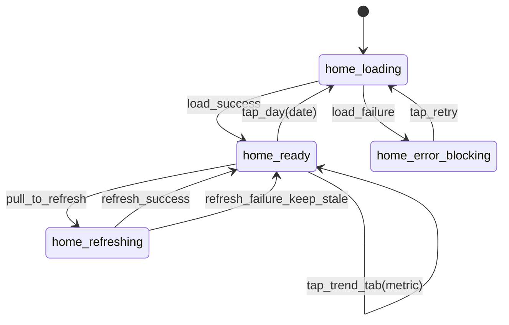
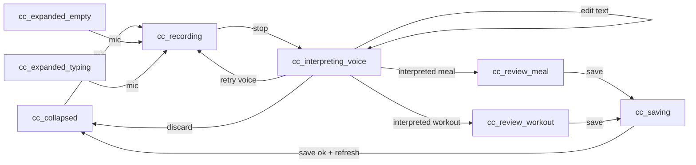
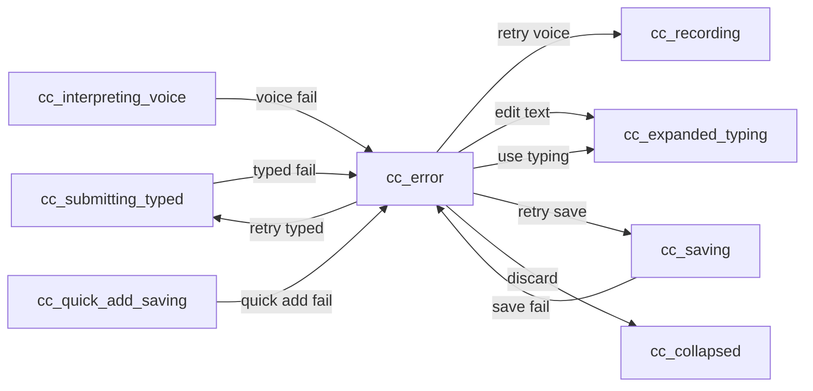

# Home Screen Interaction + State Spec (v2)

- Last updated: 2026-02-11
- Screen: Home
- Status: Draft v2.0 (review-state parity with Command Center v3)
- Owner: Product + Design + Eng

## Source links
- UI source-of-truth index: `/Users/samarth/Desktop/Work/voicefit-all/voicefit-mobile/prototypes/spec-ui-source-of-truth.md`
- Design decisions: `/Users/samarth/Desktop/Work/voicefit-all/voicefit-mobile/prototypes/design-decisions.md`
- Home implementation checklist: `/Users/samarth/Desktop/Work/voicefit-all/voicefit-mobile/prototypes/implementation-checklists/home-screen-implementation-checklist.md`
- Home prototype: `/Users/samarth/Desktop/Work/voicefit-all/voicefit-mobile/prototypes/home.html`
- Command Center expanded prototype: `/Users/samarth/Desktop/Work/voicefit-all/voicefit-mobile/prototypes/log.html`
- Voice recording prototype: `/Users/samarth/Desktop/Work/voicefit-all/voicefit-mobile/prototypes/voice-recording.html`
- Review meal prototype: `/Users/samarth/Desktop/Work/voicefit-all/voicefit-mobile/prototypes/voice-review-meal.html`
- Review workout prototype: `/Users/samarth/Desktop/Work/voicefit-all/voicefit-mobile/prototypes/voice-review-workout.html`
- Command Center canonical spec: `/Users/samarth/Desktop/Work/voicefit-all/voicefit-mobile/prototypes/interaction-specs/command-center-interaction-spec.md`
- Home assets: `/Users/samarth/Desktop/Work/voicefit-all/voicefit-mobile/prototypes/assets/home/asset-inventory.md`
- Home implementation screenshots (web run): `/Users/samarth/Desktop/Work/voicefit-all/voicefit-mobile/output/playwright/home-states/`

## Rendered diagram artifacts
- Home data state diagram (PNG): `/Users/samarth/Desktop/Work/voicefit-all/voicefit-mobile/prototypes/interaction-specs/diagrams/home-data-state.png`
- Command center typed + quick-add flow (PNG): `/Users/samarth/Desktop/Work/voicefit-all/voicefit-mobile/prototypes/interaction-specs/diagrams/command-center-typed-quickadd-flow.png`
- Command center voice + interpret flow (PNG): `/Users/samarth/Desktop/Work/voicefit-all/voicefit-mobile/prototypes/interaction-specs/diagrams/command-center-voice-interpret-flow.png`
- Command center error/recovery flow (PNG): `/Users/samarth/Desktop/Work/voicefit-all/voicefit-mobile/prototypes/interaction-specs/diagrams/command-center-error-flow.png`
- Home interaction flowchart (PNG): `/Users/samarth/Desktop/Work/voicefit-all/voicefit-mobile/prototypes/interaction-specs/diagrams/home-interaction-flow.png`
- Diagram path index: `/Users/samarth/Desktop/Work/voicefit-all/voicefit-mobile/prototypes/interaction-specs/diagrams/README.md`

## Rendered Home implementation screenshots (web)
- Home collapsed ready: `/Users/samarth/Desktop/Work/voicefit-all/voicefit-mobile/output/playwright/home-states/01-home-collapsed.png`
- Command center expanded empty: `/Users/samarth/Desktop/Work/voicefit-all/voicefit-mobile/output/playwright/home-states/02-cc-expanded-empty.png`
- Command center expanded typing: `/Users/samarth/Desktop/Work/voicefit-all/voicefit-mobile/output/playwright/home-states/03-cc-expanded-typing.png`
- Typed interpreting: `/Users/samarth/Desktop/Work/voicefit-all/voicefit-mobile/output/playwright/home-states/04-cc-submitting-typed.png`
- Meal/workout review state: `/Users/samarth/Desktop/Work/voicefit-all/voicefit-mobile/output/playwright/home-states/05-cc-review-state.png`
- Save progress: `/Users/samarth/Desktop/Work/voicefit-all/voicefit-mobile/output/playwright/home-states/05-cc-auto-saving.png`
- Post typed save collapse: `/Users/samarth/Desktop/Work/voicefit-all/voicefit-mobile/output/playwright/home-states/06-home-after-typed-save.png`
- Workout review state: `/Users/samarth/Desktop/Work/voicefit-all/voicefit-mobile/output/playwright/home-states/06b-cc-review-workout.png`
- Quick-add saving: `/Users/samarth/Desktop/Work/voicefit-all/voicefit-mobile/output/playwright/home-states/07-cc-quick-add-saving.png`
- Post quick-add save collapse: `/Users/samarth/Desktop/Work/voicefit-all/voicefit-mobile/output/playwright/home-states/08-home-after-quick-add.png`
- Recording: `/Users/samarth/Desktop/Work/voicefit-all/voicefit-mobile/output/playwright/home-states/09-cc-recording.png`
- Interpreting voice (editable transcript): `/Users/samarth/Desktop/Work/voicefit-all/voicefit-mobile/output/playwright/home-states/10-cc-interpreting-voice.png`
- Error voice interpret failure: `/Users/samarth/Desktop/Work/voicefit-all/voicefit-mobile/output/playwright/home-states/11-cc-error-voice.png`
- Error fallback to edit text: `/Users/samarth/Desktop/Work/voicefit-all/voicefit-mobile/output/playwright/home-states/12-cc-error-edit-text-fallback.png`
- Error typed interpret failure: `/Users/samarth/Desktop/Work/voicefit-all/voicefit-mobile/output/playwright/home-states/13-cc-error-typed.png`
- Error auto-save failure: `/Users/samarth/Desktop/Work/voicefit-all/voicefit-mobile/output/playwright/home-states/14-cc-error-save.png`
- Error mic permission denied: `/Users/samarth/Desktop/Work/voicefit-all/voicefit-mobile/output/playwright/home-states/15-cc-error-mic-permission.png`
- Error quick-add failure: `/Users/samarth/Desktop/Work/voicefit-all/voicefit-mobile/output/playwright/home-states/16-cc-error-quick-add.png`

## 1) Purpose and scope
Define exact behavior for Home UI and transitions so implementation, QA, and agent handoffs use one canonical behavior contract.

Included in scope:
- Home content load/refresh/error behavior.
- Day picker and trends tab interactions.
- Home navigation actions (Coach, Meals, Workouts, Settings, Add).
- Command center behavior from Home (collapsed, expanded, typed, voice, review, save, error).

Out of scope:
- Detailed Coach chat behavior (covered by Coach spec).
- Detailed Meals list/detail behavior (covered by Meals spec).
- Detailed workout/session behavior outside command-center review flow.

## 2) State model

### 2.1 Home data state machine
- `home_loading`: initial blocking fetch for selected day.
- `home_ready`: full Home content rendered for selected day.
- `home_refreshing`: non-blocking refresh after pull-to-refresh.
- `home_error_blocking`: initial load failed and no renderable data exists.

### 2.2 Command center state machine (from Home)
- `cc_collapsed`
- `cc_expanded_empty`
- `cc_expanded_typing`
- `cc_submitting_typed`
- `cc_recording`
- `cc_interpreting_voice`
- `cc_review_meal`
- `cc_review_workout`
- `cc_saving`
- `cc_quick_add_saving`
- `cc_error`

Command-center state/event contract is canonical in:
- `/Users/samarth/Desktop/Work/voicefit-all/voicefit-mobile/prototypes/interaction-specs/command-center-interaction-spec.md`

## 3) Event-to-transition table

### 3.1 Home data transitions

| Event | From | To | Guard/Condition | Side effects |
|---|---|---|---|---|
| `screen_opened` | `home_loading` | `home_ready` | API success | Render selected-day data (default = today). |
| `screen_opened` | `home_loading` | `home_error_blocking` | API failure | Show blocking error state with retry. |
| `tap_retry_blocking` | `home_error_blocking` | `home_loading` | Always | Re-run Home load query. |
| `pull_to_refresh` | `home_ready` | `home_refreshing` | Always | Re-fetch selected day payload. |
| `refresh_success` | `home_refreshing` | `home_ready` | Always | Patch data in place; preserve scroll position. |
| `refresh_failure` | `home_refreshing` | `home_ready` | Keep stale data | Show non-blocking refresh failure affordance. |
| `tap_day(date)` | `home_ready` | `home_loading` | Date in visible 7-day strip | Set selected date and fetch day payload. |
| `day_load_success` | `home_loading` | `home_ready` | Always | Render selected day and update highlight. |
| `day_load_failure` | `home_loading` | `home_error_blocking` | No cached day data | Show blocking error for selected day. |
| `tap_trend_tab(metric)` | `home_ready` | `home_ready` | Metric in `{calories, steps, weight}` | Switch chart metric and summary text. |

### 3.2 Home navigation transitions

| Event | From | To | Guard/Condition | Side effects |
|---|---|---|---|---|
| `tap_ask_coach` | `home_ready` | `home_ready` | Always | Navigate to Coach screen. |
| `tap_recent_meals_see_all` | `home_ready` | `home_ready` | Always | Navigate to Meals screen. |
| `tap_add_button` | `home_ready` | `cc_expanded_empty` | Always | Open command center expanded sheet. |
| `tap_tab_home` | `home_ready` | `home_ready` | Already on Home | No-op. |
| `tap_tab_workouts` | `home_ready` | `home_ready` | Always | Navigate to Workouts tab. |
| `tap_tab_settings` | `home_ready` | `home_ready` | Always | Navigate to Settings tab. |

### 3.3 Command center transitions on Home

- Typed meal/workout path:
  `cc_expanded_typing` -> `cc_submitting_typed` -> `cc_review_meal` or `cc_review_workout` -> `cc_saving` -> `cc_collapsed` (+ Home refresh)
- Voice meal/workout path:
  `cc_recording` -> `cc_interpreting_voice` -> `cc_review_meal` or `cc_review_workout` -> `cc_saving` -> `cc_collapsed` (+ Home refresh)
- Quick add path:
  `cc_expanded_empty` or `cc_expanded_typing` -> `cc_quick_add_saving` -> `cc_collapsed` (+ Home refresh)
- Error path:
  any interpret/save failure -> `cc_error` with subtype-specific CTA mapping.

## 4) UI contract by state

### 4.1 Home UI contract

| State | Required visible UI | Disabled/hidden UI | Notes |
|---|---|---|---|
| `home_loading` | Safe-area scaffold + loading placeholders | Content taps disabled | Blocking initial load. |
| `home_ready` | Header, day picker, calorie ring, steps/weight cards, Ask Coach card, trends, meals, collapsed command center, tab bar | None | Main interaction state. |
| `home_refreshing` | Same as `home_ready` + refresh spinner | No full-screen blocker | Existing content remains visible. |
| `home_error_blocking` | Error title/body + retry CTA | Home content hidden | Used only when no renderable data exists. |

### 4.2 Command center UI contract on Home

| State | Required visible UI | Disabled/hidden UI | Notes |
|---|---|---|---|
| `cc_collapsed` | Floating bar with sparkle + placeholder + mic | Sheet hidden | Persistent on Home. |
| `cc_expanded_empty` | Expanded sheet (title, close, textarea placeholder, quick-add rows, mic, disabled send) | Host interactions blocked | Matches `log.html`. |
| `cc_expanded_typing` | Expanded sheet with enabled send | Host interactions blocked | Draft preserved while open. |
| `cc_submitting_typed` | Interpreting loading sheet for typed input | Inputs disabled | Pending typed interpretation. |
| `cc_recording` | Timer + waveform + stop control + close | Host interactions blocked | Matches `voice-recording.html`. |
| `cc_interpreting_voice` | Transcript editor + interpreting indicator + edit/retry/discard actions | Host interactions blocked | User can correct transcript before interpret completes. |
| `cc_review_meal` | Transcript, confidence, meal card, ingredients, time row, discard/save actions | Host interactions blocked | Matches `voice-review-meal.html`. |
| `cc_review_workout` | Transcript, confidence, workout card with set table, session row, discard/save actions | Host interactions blocked | Matches `voice-review-workout.html`. |
| `cc_saving` | Save spinner/progress | Inputs disabled | Shared for typed/voice review save. |
| `cc_quick_add_saving` | Quick-add save progress | Additional taps blocked | Fast save state. |
| `cc_error` | Subtype-specific title/body/actions | Non-applicable actions hidden | CTA mapping locked by Command Center spec. |

## 5) Side effects and data contracts

### 5.1 Home data dependencies
- Primary query is dashboard payload keyed by `selectedDate`.
- Payload must include calories summary, steps, weight, trends, recent meals, goals.
- On successful command-center save, Home queries refresh automatically.

### 5.2 Navigation side effects
- `tap_ask_coach` -> Coach screen.
- `tap_recent_meals_see_all` -> Meals screen.
- Tab taps switch to tab roots.

### 5.3 Typed and voice side effects
- Typed send: interpret -> review (meal/workout) -> explicit save -> refresh.
- Voice stop: transcribe -> interpreting state (editable transcript) -> review -> save -> refresh.
- Transcript edit in interpreting state restarts voice interpretation.
- Steps/weight/question intents can bypass review and save directly.

### 5.4 Error and recovery
- Blocking initial load failures use `home_error_blocking`.
- Refresh failures keep stale content visible.
- Command-center failures route to `cc_error` with locked subtype copy + CTA mapping.
- Retry must preserve the last draft/transcript/payload for deterministic recovery.

## 6) Mermaid diagrams

### 6.1 Home data state diagram


### 6.2 Command center typed + quick-add (Home)
```mermaid
flowchart LR
  A[cc_collapsed] -->|open| B[cc_expanded_empty]
  B -->|type| C[cc_expanded_typing]
  C -->|send typed| D[cc_submitting_typed]
  D -->|interpreted meal| R1[cc_review_meal]
  D -->|interpreted workout| R2[cc_review_workout]
  R1 -->|save| E[cc_saving]
  R2 -->|save| E
  B -->|quick add| H[cc_quick_add_saving]
  C -->|quick add| H
  E -->|save ok + refresh| A
  H -->|save ok + refresh| A
  C -->|type_text(empty)| B
  B -->|close| A
  C -->|close| A
```

### 6.3 Command center voice + interpret (Home)


### 6.4 Command center error/recovery (Home)


## 7) QA acceptance checklist
- Home initial load transitions cleanly from loading to ready.
- Blocking load failure recovers via retry.
- Pull-to-refresh keeps visible content while fetching.
- Day picker renders last 7 days ending today (no future dates).
- Trend metric switching does not leave `home_ready`.
- Collapsed command center is always present in Home-ready.
- Expanded, recording, interpreting, review meal/workout, saving, and error states all match referenced prototypes/spec.
- Typed meal/workout path requires explicit review save.
- Voice meal/workout path requires explicit review save.
- Save success refreshes Home and collapses command center.
- Error copy and CTA mapping match command-center spec exactly.
